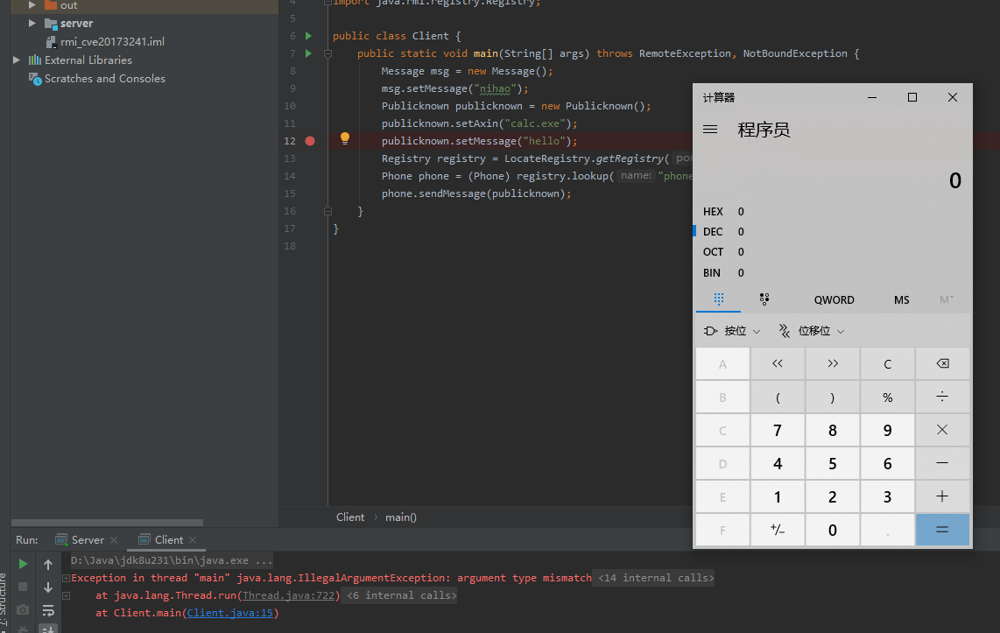

# rmi_cve20173241

先运行Server,然后运行Client。

对了，代码忘记将serialVersionUID写死了，但是这个不存在问题，如果客户端与服务端的对象serialVersionUID不匹配，服务端是会报错的，而且错误会返回到客户端，其中就包括服务端对象的serialVersionUID，在利用时只要对应修改一下客户端构造的对象的serialVersionUID就行。^^

漏洞原理参考：https://www.freebuf.com/vuls/126499.html
